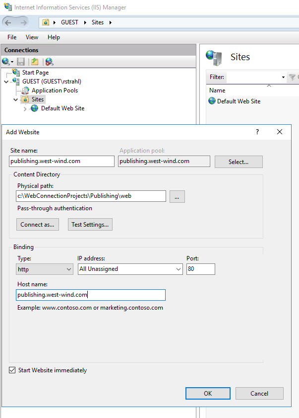

# Deploying and Configuring Web Connection Applications

*by:* [Rick Strahl](https://weblog.west-wind.com), West Wind Technologies

*October 4th, 2019*  
*prepared for:*  [Southwest Fox 2019](http://www.swfox.net/)  
[Session Materials](https://github.com/RickStrahl/SWFOX2019_WebConnectionDeployment)

So, you've built your shiny new Web Connection Application on your local machine for development and you're proud of what you've accomplished. Now it's time to take that local masterpiece and get it online. How you do this?

In this article I'll take you to the process of creating a small placehold application and deploy it to a live server on a hosted service called [Vultr](https://www.vultr.com/?ref=6820014) which provides low cost, and high performance virtual machine services that are ideal of hosting a Web Connection site.

Here's what we'll cover:

* Creating a new project
* Modifying the project slightly
* Setting up a Vultr Virtual Machine Windows Server
* Configure the Web Server
    * Install IIS
    * Install FoxPro
* Package the Web Connection Project
* Upload the project
* Set up the project on the server
* Test the application
* Make code changes and update the server
    

## Creating new Applications - Projects Organize your Application
Starting with Web Connection 6.0 the process of creating a new application has been made much more consistent through a way of organizing a project into a well-known folder structure. The idea is to recognize what most projects are made up out of which is:

* Code and/or Binary files
* Web content
* Data

The Web Connection new project structure create a single top level folder, with subfolders for `Deploy` (code and binaries), Web and Data. The `Deploy` folder then also contains the `Temp` folder where message files and logs are stored.

To demonstrate lets create a brand new Web Connection application called 'Publishing'. I won't put any logic into this project other than making a few text changes - it'll be a stock project, but that's all we need and it'll make for a small project to distribute to boot.

## Creating a new Web Connection Project
Create the new project by typing `DO Console` in FoxPro **as an Administrator**.


I chose the name for the project and the Process class as `Publishing` and `PublishingProcess` respectively. Note I use IIS Express here locally so I don't have to install anything.


I use the default to create the project in the `WebConnectionProjects` folder, but you can really put this project anywhere. I also set up a script map for the `.pb` extensions so I can access requests with `.pb` and map them to Web Connection handlers.


Finally I publish the project as a Web project and let 'er rip. If all is working you should now have a running Web Connection Server:


Notice that Web Connection 7.0 and later now has a simple startup process that automatically starts the application with `DO Launch` or `Launch()`. This does the following:

* Launches the Web Server if required (IIS Express in this case)
* Launches the Web Connection Server
* Opens a Web Browser on the default URL (http://localhost:7000 for IIS Express)

You should be able to click around the Web page to access the sample links at this point.

We have a running application.

### Making a couple of small Changes
Just so we can see something a little custom, lets change the two sample links. To show off some of the new features in Web Connection 7.0 lets highlight site editing and Live Reload functionality. 

If you have [Visual Studio Code](https://code.visualstudio.com/) installed you can click on the **Edit button** and open your new site in VS Code. Code is a great light weight cross platform text editor with support for tons of languages [including FoxPro](https://marketplace.visualstudio.com/items?itemName=NewDataSystems.foxpro). The editor command is configurable in `Publishing.ini` and it defaults to open VS Code in the project root, which displays both the `Deploy` and `Web folders`


* **Deploy** - Holds all your FoxPro Source code and 'server' resources
* **Web** - Holds all your Web files (templates, html, css, js etc.)

#### Enabling Live Reload
A new feature in Web Conection 7.0 is live reload which lets open your Web page, and when you make a change to any Web files, or source code (outside of FoxPro's editor say from VS Code), the code is updated and the browser auto-refreshes. So, when you make a change you see that change immediately reflected in the browser.

#### Ch..., Ch..., Changes
Let's make some changes. Let's open the `web/default.htm` page and change the headline. Position the Web Browser and Editor so you can see both. Then go in the editor and change the `Feature Samples` header text to `Web Connection Deployment Demo`. If you pay attention you'll see that as soon as you save the change to disk, the Web Page shows the new header! The same works if you make changes to a CSS or JS file.

We can also make changes to Web Connection templates. Open `web/HelloScript.pb` page which is the second test link. You probably want to add the syntax in VS Code, by clicking on the language drop down in the lower right of VS Code's status bar and choose HTML. Again make a change to the header and chage it from the Hello World text to `Ready to Deploy Application`.

Finally we can even make code changes and see those reflected. Open `deploy/publishingProcess.prg` and change the `StandardPage()` header in the `TestPage()` method to read `Hello from FoxPro Publish Project`. Save and notice that the FoxPro server shuts down and restarts itself, and then refreshes the Web page to show the new text.

This is a new feature that is very productive.

> ##### @icon-warning Important
> Make sure you **turn Live Reload off for production** applications as this feature has some overhead. This feature **requires IIS 10 or later** (Server 2012 R2 /Windows 10 or later or IIS Express 10).

## Ready to Publish
Ok - so we've made some changes to our project to have a highly, highly customized Web Server we can publish to a brand new Web Server machine. Right? :-)

### Build an EXE
Generally I like to run my application during development using just the PRG Files. I launch with `DO PublishingMain.prg` (or have it launch through the new `launch.prg`). Once I'm ready to deploy however, I need to compile the project into an EXE that can be deployed to the server. 

> ##### @icon-info-circle Admin Rights Required for Compilation
> Note you need to be an Administrator to compile the project as the project contains a COM component which has to be registered.

### Test your Server as an EXE and COM Object
Beyond that you should test your server as it would be run on the server:

* Turn off Debug Mode
* Run the EXE from Explorer
* Or: Invoke the COM Object

If you're running in COM object, before anything test by instantiating the COM server like this in VFP:

```foxpro
o = CREATEOBJECT("Publishing.PublishingServer")
? o.ProcessHit("query_string=wwMaint~FastHit"))
```

This fires a test request against the server. You can also access a specific page as a GET request with:

```foxpro
? o.ProcessHit("physical_path=Testpage.pb")
```

You can use `ShowText()` or `ShowHtml()` in wwUtils.prg to display the content if it's long.

### Run the Application as an EXE or COM Object Locally
Once that works next run your application using the EXE or the COM object. In theory this should just work because you're running the same application in exactly the same environment so other than the packaging an EXE is no different than running inside of the FoxPro IDE.

Switching to COM can be done on the Admin Page.

* Admin Page at [http://localhost:7000/admin/admin.aspx](http://localhost:7000/admin/admin.aspx)
* Then click on the **Web Connection Module Administration**

On this page you can toggle Web Connection between File and COM Mode. Here I've switched into COM mode:


When Web Connection compiles it locally registers the server for the `INTERACTIVE` user so servers can show on the desktop. Note that standard COM registration will not do this and simply inherit the IIS account that is running the Application Pool.

You'll want to test your application now running in COM mode as well as file mode as an EXE and ensure the app runs as you'd expect locally.

> If the app doesn't run locally, it sure won't run on the Web Server either, so make sure it all works **before you send it up to the server**. 
>
> Debugging is a lot easier locally than on a remote Web server!

## Understanding the Project Layout
So at this point you should have a project that works and runs. The next step is to package up everything into something you can install on the new server. 

Let's review a new project layout.


### Root Folder
The root folder of the project contains administration files. IIS Installation, a `build.bat` you can use to package files and a link to locally start FoxPro in the `deploy` folder.

### Deploy Folder: Source Files and Binaries
The `deploy` folder is your FoxPro folder - this is where you code goes as well as the compiled binary of your application (the EXE). The folder also holds Web Connection support DLLs that need to be deployed to the Web server. 

When you deploy this folder only the binary files are picked up - source code files are ignored.

### Web Folder: Web Resources
The Web Folder holds all your Web resources which are Web Connection Scripts and Templates, HTML, CSS and JavaScript files, images and anything else that your Web application needs to run.

### Packaging up Everything: Build.bat
To help with getting everything ready for a first time deploy when you basically need to move everything to the Web server, Web Connection 6.5 and later provides a `build.bat` in the root folder.

You can run it by double clicking on the folder which produces a new `Build` directory which contains all the copied files and a zip file of everything. 


You're now ready to take that publish file to your server.

But before we can do that we need to configure the server and get it ready for running as a Web Server.

## Setting up a New Virtual Server

I'm going to use a brand new Virtual Server on [Vultr](https://www.vultr.com/?ref=6820014) which is the hosting company I use to host my own Web sites. Vultr is very reasonably priced (especially compared to Azure and AWS), and provides high performance hardware for the prices they charge. Vultr is a plain VPS provider meaning they provide virtual and physical servers, storage space but little else in the way of services. If you need support services, like extra storage, hosted SQL or NoSQL solutions, then you need to look into more complete services like Azure or AWS. But if all you want is to create a Virtual Server to host in the cloud, then you'll be hard pressed to beat the value that Vultr provides. I spent a lot of time looking around for a good Windows hosting service, and Vultr is what I ended up with.

I can spin up a new Vultr VPS server in about 10 minutes and I've done so for this demonstration. 


This is what I think is the minimum hosting set up you should use for a Web Connection application which is:

* 2 cores (never use a single core setup!)
* 4gb of RAM
* 80gb of Disk Space
* Windows Server 2016

This setup costs $40/month and includes the Windows Server license. I use an older version of this package for hosting my Web Server and that site runs 20+ sites, SQL Server, MongoDb. This hardware goes a long way and it's very fast for all of my Web sites. The biggest limitation on this package is the disk space. 80gb is not a lot when you figture the Windows footprint  (my old package is more expensive but includes more disk space). The next step up is $70 for 4 cores, 16gb RAM and 160gb of storage which is totally worth it if you need it. 

Remember these specs are for VPS servers which doesn't reliably compare to 'real' processors, but I found that Vultr is much closer than Azure or Amazon in performance to what I would expect in a physical setup of these specs. And on either of those platforms you'd pay **at least** twice as much for lesser VPS hardware.

### Remote Desktop for Server Setup
Vultr sets up a new virtual Server which is basically base Windows Server 2016 installation. The first thing we need to do is use Remote Desktop into the new server and start configuring it. 

#### Create a new User


#### Install Required Software
Next up there are a number of bits of software that are needed. I highly recommend you use Chocolatey for this. Chocolatey is a package manager for Windows that allows you quickly install common tools and applications for Windows silently from the commandline. You install Chocolatey which is an application that sits in your global path and lets you execute chocolately commands. 

To install Chocolatey you can run a single Powershell command:

```ps
Set-ExecutionPolicy Bypass -Scope Process -Force; iex ((New-Object System.Net.WebClient).DownloadString('https://chocolatey.org/install.ps1'))
```

Once it's installed you can install software from the command line - silently. For example:

```ps
choco install vscode
choco install GoogleChrome
```

So steps are:

* Install Chocolatey
* Run a Chocolatey script to install tools
    * VS Code Editor
    * A decent Browser (Chrome or Firefox or Edgium)
    * 7zip
    * FileZilla FTP Client
    * FileZilla FTP Server (if you need to upload files)
* Install IIS using script
* Install [Visual FoxPro Runtimes](https://github.com/VFPX/VFPRuntimeInstallers) (or full IDE)
* Install FoxPro SP2 (if installing IDE)

I've provided scripts for all these tasks in the [Github Repository](https://github.com/RickStrahl/SWFOX2019_WebConnectionDeployment) for this session with the exception of the FoxPro installation. I tend to store scripts like these in an `\admin` folder off the root of the server.

The IIS install Script ships with Web Connection. The others are custom scripts I use and am sharing here - make sure you check them before running to add or remove those that don't fit your enviroment. You can find more things to install on the [Chocolatey site search](https://chocolatey.org/packages).

#### Install Chocolatey
Once installed you should shut down Powershell and restart it. Once installed you can now easily install any of chocolatey's packages. On the server there are a few things that I consider ABSOLUTELY necessary:

```ps
# Don't prompt for installations
choco feature enable -n allowGlobalConfirmation

# Remove the annoying UAC prompts on Server
choco install disableuac    

# Install essential Apps
choco install GoogleChrome
choco install vscode
choco install 7zip.install
choco install curl
choco install filezilla
choco install git
choco install tortoisegit
choco install xplorer2
choco install procexp
```

You can check Chocolatey for additional things you might need on the server - there are hundreds of tools and applications and even full software to install from there.

#### Install IIS
Next you need to install IIS on the server. Windows Server makes this a royal pain in the ass with it's user-hostile Roles and Features interface. 

Luckily you can sidestep that mess, and use a powershell script instead.

Web Connection ships with an `Install-IIS-Features.ps1` script that installs all the required components needed to run a Web Connection application. You can go to your local machine and copy that script to the clipboard, then create a new Powershell file called `Install-Iis-Features.ps1` and run it **as an Administrator**.

Keep an eye on the script execution and look for errors. This script takes a while to run (about 5 minutes or so on my test server).

#### Install Web Deploy
Web Deploy is an IIS plug-in that allows you to deploy IIS from other machines using the MsDeploy tool. MSDeploy is integrated into Visual Studio and I'll use that to publish the site to IIS. 

The IIS Script includes the Chocolatey code to also install `WebDeploy` as well as `UrlRewrite` which is another add-on module for IIS. The default script has these commented out because they use Chocolatey and so may fail if it's not installed. Uncomment them before running the script or if you forgot execute them one at a time after the IIS install is complete:

```ps
choco install WebDeploy
choso install UrlRewrite
```

## Setting up your Web Connection Application
Ok the server is ready. Now we need two more steps:

* Copy the packaged Build files to the server
* Configure the Web Connection Web Site


### Copying Files
Ok so now the server is configured and ready to go - all we need to do now is get our Web site over to it.

There are a few ways to do this:

* Remote Desktop Drive Mapping to Local Drive
* Visual Studio Publish
* Install an FTP Server and FTP the files

The easiest here is the Remote Desktop File sharing and while that works it's infuriatingly slow, but it works and that's what I'll use here. I'll also show using Web Deploy and Visual Studio publishing later to update Web resources.


Now create a new folder structure into which to unpack the files. It can be anywhere - personally I like to use the same structure as I had on my client install so I'll put it in:

```ps
c:\webconnectionprojects\publishing
```

This should match the structure of your local files.

### Create the IIS Web Site and Configure the Application Pool
This is the only manual configuration step - we need a Web site which can be configured for Web Connection.

So create a new Web Site. Open the IIS Manager:


Then create the Site by pointing it at the `web` folder of the Publishing project:



In addition I'll also need to set a hostname binding for the DNS name which is `publishing.west-wind.com`. I've already set the DNS hostname at my provider which is **DnSimple** associating the servers IP address with a DNS A record in the DNS records for the `west-wind.com` site. 


This is necessary so the site can be accessed remotely on a shared port 80 with a custom domain name.

We'll also need to configure the Application Pool. The Application Pool is the IIS host process for the application and it determines the environment in which the Web Connection server runs. The most important bits here are the user account it runs under.

Go to Application Pools and open the `publishing.west-wind.com` Pool:


The most important item is the `Identity` - by  default this is set `ApplicationPool Identity` which is **very low rights** account that has no local access rights and can't be easily configured using the Windows user dialogs. For Web Connection applications this default account doesn't work because Web Connection requires file access in the startup folder (especially for file based operation) as well as rights to execute COM server, none of which ApplicationPool User has.

So - change the user to an account that has the required rights. I suggest to start, run with LOCALSYSTEM as it has full permissions. Make sure you get your app running first, and once it's up and running and working, you can dial back the security with a specific account that you give the exact rights required to run the application.

Note we'll need the Site ID of this site in order for Web Connection to be able to configure this site. Go the site list and note the site ID of the new site:

### Configuring the Web Connection Web Site
Now that the site is up and configured, we still need to configure Web Connection so it's connected to this new Web Site.

To do this we can use the Configuration Feature in Web Connection which allows you to do a server config by running your EXE with a `CONFIG` parameter. But before you do that we need to apply the Site ID from above to the configuration settings which are stored in the app ini file - in `publishing.ini`:

```ini
[ServerConfig]
Virtual=
ScriptMaps=wc,wcs,md,pb
IISPath=IIS://localhost/w3svc/2/root
```

Note that I applied the SiteID in the IIS path before the `/root`. This basically set create a new virtual at the root (Virtual empty) at the IIS path specified on site 2 and create scriptmaps for wc, wcs,md and pb.

With the configuration set we can now run the config and hook up our Web Connection server settings to IIS.

```ps
Publishing.exe CONFIG
```

This should take 20-30 seconds or so to run as the configuration creates the virtual, configures the Application Pool, creates the scriptmaps and sets file permissions.

Once that's done you should now have a functioning Web Connection server and Web site.

### Testing
I recommend you start in file mode, so perhaps double check your `web.config` file and make sure that:

```xml
<add key="MessagingMechanism" value="File" />
```

The go to the `deploy` folder and launch your main EXE -  `Publishing.exe` in this case. This starts the file based Web Server.

Now navigate to your DNS location on the local machine - or any browser:

http://publishing.west-wind.com

Assuming DNS has resolved you should be able to get to the Default page now. Click on the two sample links and you should see our custom headers in the application.


Yay! Success.

Now, go to the Administration page at:

http://publishing.west-wind.com/admin/admin.aspx  
<small>* no you won't have access to mine at this address</small>

Then to **Web Connection Module Administration** and **File -> Switch** to toggle into COM mode. Go back to the home page and hit those two links again and if all goes well the application should still work the same as in file mode.

Hoorah again!

### Create a LetsEncrypt Certificate
You may notice in the picture above that Chrome is complaining that the site is *Not secure*. This is because the site is running without SSL. In order to make the link display less scary, you need to install a TLS certificate so the site can run over HTTPS.

A few years ago LetsEncrypt - an consortium of various Internet Service Providers - created a certificate authority not beholden to a commercial company with the goal to provide free SSL/TLS certificates. It was a huge success and LetEncrypt is now serving billions of certificates. This organization which is supported solely through donations and sponsorships not only has made certificates free, but also provided the tools that make it possible to completely automate the process of installing and renewing certificates.

Using these tools it literally takes two minutes or less to create a certificate and install it in IIS including a setup that auto-renews the certificate when it expires in 90 days or so.

On Windows there's an easy to use tool called [Win-Acme](https://pkisharp.github.io/win-acme/) that makes this process trivially simple via a command line tool.

Download the tool and copy the files into a location of your choice. I use `\utl\LetsEncrypt`. Open a command window in that location and run `.\Wacs.exe` to bring up the command line based interface.


It literally takes only a few prompts and you're ready to go with a new certificate.

After you've installed a certificate we can now navigate to the site over `https://` and get a less scary browser bar:


Certificates installed this way by default are automatically renewed after 90 days. Note that certificates are shorter lived, but with the auto-renewal is relatively painless to renew more often because it happens automatically.

## Updating your Server and Maintenance
Once you've uploaded your site and got it all running, you're invariably going to want to change something about the site whether it's HTML content, or the actual compiled code.

### Updating Web Content
There are a number of ways you can update content obviously. 

* Visual Studio Web Deploy for Site, or individual Files
* Manual FTP of Files
* RDP file copy (too slow to be used on a regular basis)

#### Visual Studio and Web Deploy
I like to use Visual Studio proper along with its Web Deploy features, because it's directly integrated into Visual Studio and super easy to push up either individual files or the entire site.

You can view Web Connection Web projects quite nicely in Visual Studio using the `Web Site Projects`. This is an old project type so it's a bit out of the way now.

Go to File -> Open -> Web Site which opens the site in Visual Studio. You can now edit files and make changes using Visual Studio.

When you're ready to publish or update files right click on the project node:

* Select Publish Web Application
* Publish to IIS
* Fill in the info for the Dialog


Note that this **requires WebDeploy** which I installed as part of the IIS installation earlier. If WebDeploy is not installed on the server you're likely going to see long hangs and timeouts here.

Once set up you can now publish either the entire site, or individual files. Right click on the project to publish the full site, or right click on a file to publish just that file.

One really nice thing about this tool is that it is smart and compares what's on the server to what's on the client and only updates what's changed. Even if you publish the full site but only changed 1 or 2 files, only those files plus some meta data is sent to the server. This makes Web Publish very efficient and fast. I often publish individual files using the default hot key `Alt-;-P` which isn't very intuitive but because I use it so much I have muscle memory from it :-).

You can also use WebDeploy to send up other files. For example, if it turns out you need new versions of the Web Connection support DLLs you can zip them up and upload them into the Web site temporarily. You can then RDP into the server pick up the zip file and swap ou the DLLs. The same works for any other resources files.

You can do pretty much the same thing if you have an FTP server installed and if you transfer lots of files to the server all the time a dedicated FTP server is more flexible than WebDeploy and it's close ties to Microsoft tools. FTP works with any thing, but it's beyond the scope of this session to talk about setting up an FTP server.

#### Update your Server 
Web Connection includes some tools that can let you automatically publish your updated EXE FoxPro Server by uploading it and efficiently hot-swapping it. You can do this without shutting down the Web Server.

It's possible to use a manual approach for this as well as an automated way.

The manual approach works through the Web site's Module Admin page:


The process works by letting you upload a new server executable which is named with `_Update.exe` extension. You can use the **Upload Server Exe** button to upload your new compiled EXE server to the server.

Once uploaded, click the `Update Server Exe` button to then hot-swap the server. This link will shut down all running server instances, put the server on hold so new requests start reloading the Web Connection server instances, and then copies the `_Update.exe` to actual server EXE. This routine also re-registers the COM object so if there are changes in the COM interface they are reflected in this update. All the servers are then restarted.

This process typically takes a couple of seconds, depending on how many server instances you have running and how fast they are to start up.

#### Automatic Updating via `bld_yourProject`
This manual process can also be automated directly from your FoxPro Web Connection project. When a new project is created Web Connection creates a custom PRG file that builds the Web Connection application into an EXE. Optionally you can pass a parameter of `.t.` to this function which causes it to build and then publish to the server.


Before you can do this you need to edit the generated `bld_publishing.prg` file and change the URLs for the online project. By default the URL points to `localhost` and you need to change this to point at the actual live, deployed site instead:

```foxpro
*** Server Update Urls - fix these to point at your produ ction Server/Virtual
HTTP_UPLOADURL    =         "http://publishing.west-wind.com/UploadExe.wc"
HTTP_UPDATEURL 	  =         "http://publishing.west-wind.com/UpdateExe.wc"
```

Then you can now simple run:

```foxpro
DO bld_Publishing with .T.
```

You'll get prompted for username and password, and if a valid pair is entered your EXE file is uploaded and hotswapped on the server.

## Summary
Alright - there you have it. An end to end installation of a new Web Server Virtual Server at [Vultr](https://www.vultr.com/?ref=6820014). You've seen:

* Setting up Server 2012
* Installing Applications
* Setting up IIS
* Packaging your Application
* Publishing your Application
* Testing your Application
* Installing an SSL Certificate
* Updating your Application

## Resources
* [Session Materials](https://github.com/RickStrahl/SWFOX2019_WebConnectionDeployment)
* [Vultr deal: $50 credit](https://www.vultr.com/?ref=7800880-4F)
* [Win-Acme LetsEncrypt SSL Installation](https://pkisharp.github.io/win-acme/)


